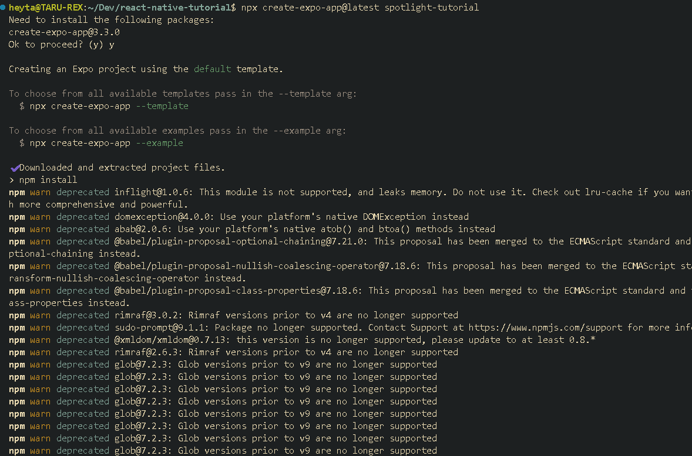
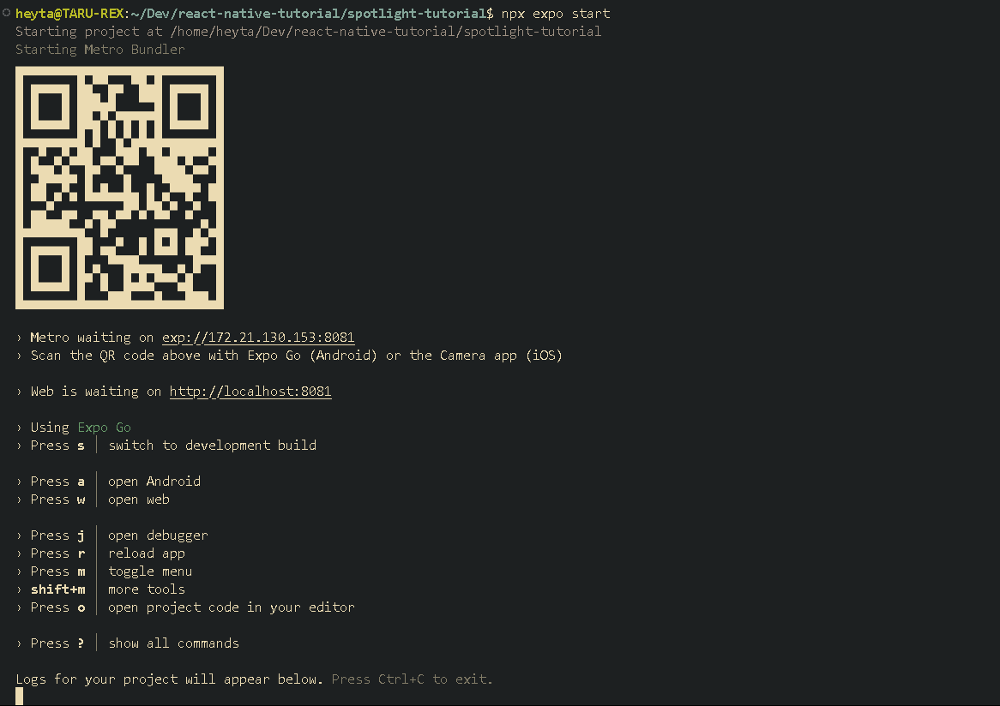

> # React Native Basic
>
> Basic information about the react and how is functioning etc

## What is react native ?

**React Native** is a framework that allows to build **_cross-platform_** mobile applications using React (Javascript/Typescript).  
Cross platform means we have to write the code once and we can deploy it to multiple platforms.

> That means react native is a react framework through which we can build cross platforms mobile applications which can run on both **ios** and **Android**.  
> [React Native Official Docs](https://reactnative.dev/)

## How to create a project in React native expo

To create a project in react native expo, first we need to install **Node JS with the npx**.  
After that we can run the _**expo-create**_ commands to create a project.

```
npx create-expo-app@latest appname
```

where the appname will be replaced by the actual app name. Then select the template which we want or we can go with the blank template and let the commands do it's job.



> Refers this link [Expo: Creating an project](https://docs.expo.dev/get-started/create-a-project/)

## How to run the project

To run the project there are two methods either by setting up the emulator or by installing the **Expo Go** o the mobile phone.
First run the below command

```
npx expo start
```

Then open the expo go app and scan the QR code which will be displayed in the terminal after running the command.



> if got the error like below then run the `yarn add expo` command to install expo
> 
